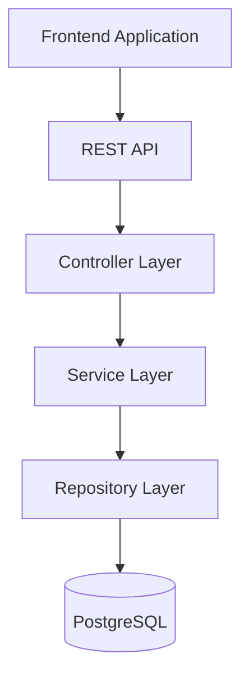
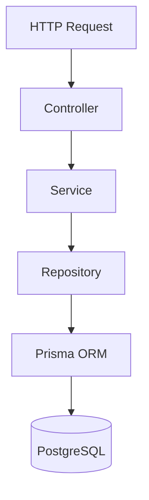

# SprintHub Blueprint

> High-level product and technical vision for SprintHub.

---

| Property         | Value           |
| ---------------- | --------------- |
| **Document**     | Blueprint       |
| **Project**      | SprintHub       |
| **Version**      | 1.0             |
| **Status**       | Approved        |
| **Owner**        | Nicolás Palacio |
| **Last Updated** | July 2026       |

---

# Table of Contents

1. Product Overview
2. Vision
3. Objectives
4. Project Scope
5. MVP Scope
6. Future Scope
7. Functional Requirements
8. Non-Functional Requirements
9. Technical Stack
10. High-Level Architecture
11. Backend Architecture
12. Frontend Architecture
13. Authentication & Authorization
14. Error Handling Strategy
15. Notification Strategy
16. Database Strategy
17. API Design Principles
18. Git Strategy
19. Testing Strategy
20. CI/CD Strategy
21. Performance Strategy
22. Documentation Strategy
23. Deployment Strategy
24. Scalability Strategy

---

# 1. Product Overview

## Product Name

SprintHub

## Product Type

Software as a Service (SaaS)

## Category

Project Management & Team Collaboration Platform

## Description

SprintHub is a modern web application designed to help individuals and teams manage workspaces, projects, tasks, and team collaboration through a clean, scalable, and maintainable platform.

The project is intentionally built as a portfolio-quality application that demonstrates modern software engineering practices, including software architecture, backend development, frontend development, security, testing, CI/CD, containerization, and technical documentation.

Rather than replicating an existing product, SprintHub combines concepts inspired by tools such as Jira, Trello, ClickUp, and Asana while maintaining its own architecture and implementation.

---

# 2. Vision

## Product Vision

Build a production-ready project management platform that demonstrates the implementation of enterprise-level software engineering practices while providing an intuitive user experience.

SprintHub aims to showcase how a modern SaaS application should be designed, documented, developed, tested, and deployed.

## Technical Vision

The application should demonstrate:

- Clean Architecture principles
- Modular application design
- Scalable backend architecture
- Feature-based frontend architecture
- Professional documentation
- Security best practices
- Automated testing
- Continuous Integration and Continuous Deployment (CI/CD)
- Containerized development and deployment
- Maintainable and extensible codebase

---

# 3. Objectives

## Business Objectives

SprintHub should allow users to:

- Create collaborative workspaces.
- Organize projects.
- Manage project tasks.
- Collaborate with team members.
- Track project progress.
- Improve productivity through structured workflows.

## Technical Objectives

SprintHub should demonstrate professional knowledge of:

- Software Architecture
- REST API Design
- Database Design
- Authentication & Authorization
- Frontend Architecture
- Backend Architecture
- Testing
- Docker
- CI/CD
- Cloud Deployment
- Documentation
- Performance Optimization
- Scalability

---

# 4. Project Scope

SprintHub focuses on project management for small teams.

The platform allows authenticated users to:

- Create workspaces.
- Invite collaborators.
- Create projects.
- Manage tasks.
- Assign responsibilities.
- Track project progress.
- Manage permissions based on user roles.

The project intentionally prioritizes software quality over feature quantity.

---

# 5. MVP Scope

The Minimum Viable Product includes the essential functionality required for a complete project management workflow.

## Authentication

- User registration
- User login
- JWT Authentication
- Refresh Token Authentication
- Logout
- Protected routes

## Workspace Management

- Create workspace
- Update workspace
- Delete workspace
- Invite members
- Remove members
- Manage member roles

## Project Management

- Create project
- Update project
- Archive project
- Delete project

## Task Management

- Create task
- Update task
- Delete task
- Assign users
- Change status
- Set priority
- Due dates

## Dashboard

- Workspace overview
- Project overview
- Task statistics

---

# 6. Future Scope

The following features are intentionally excluded from the MVP and may be introduced in future versions.

## Collaboration

- Comments
- File attachments
- Activity timeline
- Mentions
- Team chat

## Productivity

- Labels
- Custom fields
- Time tracking
- Sprint planning
- Kanban board improvements

## Notifications

- Email notifications
- Push notifications
- Real-time notifications

## Integrations

- Google Calendar
- GitHub
- Slack
- Microsoft Teams

## Infrastructure

- Redis caching
- Background jobs
- Queue processing
- WebSockets
- Horizontal scaling

---

# 7. Functional Requirements

SprintHub provides the following core functional capabilities.

## Authentication

The system shall allow users to:

- Register a new account.
- Log in using email and password.
- Refresh expired access tokens.
- Log out securely.
- Access protected resources through authenticated sessions.

---

## Workspace Management

The system shall allow users to:

- Create workspaces.
- Update workspace information.
- Delete workspaces.
- Invite members.
- Remove members.
- Assign member roles.

Supported roles include:

- OWNER
- ADMIN
- MEMBER

---

## Project Management

The system shall allow authorized users to:

- Create projects.
- Update project information.
- Archive projects.
- Delete projects.

Each project belongs to exactly one workspace.

---

## Task Management

The system shall allow users to:

- Create tasks.
- Update tasks.
- Delete tasks.
- Assign tasks.
- Change task status.
- Change task priority.
- Set due dates.
- Move tasks between projects.

---

## Dashboard

The dashboard shall display:

- Workspace summary.
- Active projects.
- Recent tasks.
- Task statistics.
- User activity overview.

---

# 8. Non-Functional Requirements

SprintHub emphasizes maintainability, scalability, security, and performance.

## Performance

- Fast application startup.
- Efficient API responses.
- Optimized database queries.
- Lazy-loaded frontend pages.
- Code splitting.
- Image optimization.

---

## Scalability

The architecture must support:

- Additional business modules.
- Increased number of users.
- Larger workspaces.
- Future microservice migration if required.

---

## Security

The application must implement:

- JWT authentication.
- Refresh Token authentication.
- Role-Based Access Control (RBAC).
- Password hashing.
- Secure HTTP cookies.
- Input validation.
- Environment variables.
- HTTPS in production.
- Rate limiting.
- Protection against common web vulnerabilities.

---

## Maintainability

The codebase should provide:

- Modular architecture.
- Consistent coding conventions.
- Layer separation.
- Reusable components.
- Shared validation schemas.
- Comprehensive documentation.

---

## Reliability

SprintHub should provide:

- Predictable API behavior.
- Centralized error handling.
- Database migrations.
- Logging.
- Health checks.

---

# 9. Technical Stack

## Frontend

- Next.js
- React
- TypeScript
- Tailwind CSS
- shadcn/ui
- TanStack Query
- React Hook Form
- Zod

---

## Backend

- Node.js
- Express.js
- TypeScript
- Prisma ORM
- JWT
- bcrypt

---

## Database

- PostgreSQL
- Prisma Migrate

---

## DevOps

- Docker
- Docker Compose
- GitHub Actions

---

## Documentation

- Markdown
- OpenAPI (Swagger)
- Mermaid Diagrams

---

# 10. High-Level Architecture

SprintHub follows a Modular Monolith architecture with clear separation between the frontend, backend, and persistence layers.



## Architectural Principles

- Separation of Concerns
- Single Responsibility Principle
- Dependency Inversion
- Modular Design
- Layered Architecture
- Feature-Based Frontend

---

# 11. Backend Architecture

The backend follows a layered architecture that separates HTTP concerns, business logic, and persistence.



## Layers

### Controller Layer

Responsible for:

- Receiving HTTP requests.
- Validating request format.
- Calling application services.
- Returning HTTP responses.

Controllers must not contain business logic.

---

### Service Layer

Responsible for:

- Business rules.
- Authorization.
- Workflow orchestration.
- Transactions.
- Domain validation.

The Service Layer represents the core business logic of the application.

---

### Repository Layer

Responsible for:

- Database operations.
- Query abstraction.
- Data persistence.

Repositories do not contain business logic.

---

### Persistence Layer

Responsible for:

- Data storage.
- Entity relationships.
- Database constraints.
- Migrations.

Implemented using Prisma ORM and PostgreSQL.

---

# 12. Frontend Architecture

SprintHub adopts a Feature-Based Architecture built on top of the Next.js App Router.

The application is organized by business domains rather than file types.

```text
src/

├── app/
├── components/
├── features/
├── hooks/
├── lib/
├── providers/
├── services/
├── styles/
├── types/
├── utils/
└── middleware.ts
```

Each feature owns its own:

- Components
- Hooks
- Services
- Schemas
- Types
- Utilities

Example:

```text
features/

tasks/

├── api/
├── components/
├── hooks/
├── schemas/
├── services/
├── types/
└── utils/
```

## Frontend Principles

- Feature-Based Organization
- Reusable Components
- Composition over Inheritance
- Accessibility First
- Responsive Design
- Type Safety
- Shared Validation
- Server State Separation
- Minimal Global State

---

# 13. Authentication & Authorization

SprintHub implements a secure authentication and authorization strategy based on JSON Web Tokens (JWT) and Role-Based Access Control (RBAC).

## Authentication

Authentication is based on two tokens:

- Access Token
- Refresh Token

### Access Token

Characteristics:

- JWT
- Short-lived
- Used to authenticate API requests
- Sent through the `Authorization` header using the Bearer scheme

Example:

```http
Authorization: Bearer <access_token>
```

### Refresh Token

Characteristics:

- Long-lived
- Stored as an HttpOnly cookie
- Used to obtain new Access Tokens
- Stored as a cryptographic hash in the database

## Authorization

SprintHub uses Role-Based Access Control (RBAC).

Supported roles include:

- OWNER
- ADMIN
- MEMBER

Permissions are enforced at the Service Layer to ensure business rules remain independent from HTTP concerns.

---

# 14. Error Handling Strategy

SprintHub provides centralized and consistent error handling across the entire application.

## Backend

Errors are handled through a Global Error Handler.

Responsibilities include:

- Capturing unexpected exceptions.
- Returning standardized error responses.
- Logging server errors.
- Preventing sensitive information leakage.

Example response:

```json
{
  "success": false,
  "error": {
    "code": "RESOURCE_NOT_FOUND",
    "message": "Project not found."
  }
}
```

## Frontend

The frontend provides consistent user feedback through global notifications.

Examples include:

- Success messages
- Validation errors
- Warning messages
- Unexpected server errors

---

# 15. Notification Strategy

SprintHub provides centralized notification handling to ensure a consistent user experience.

## Notification Types

- Success
- Error
- Warning
- Information

Notifications should be:

- Consistent
- Non-blocking
- Accessible
- Easy to dismiss

Future versions may include:

- Email notifications
- Push notifications
- Real-time notifications

---

# 16. Database Strategy

SprintHub uses PostgreSQL as its primary relational database.

## ORM

Prisma ORM is responsible for:

- Entity mapping
- Query generation
- Type safety
- Database migrations

## Migration Strategy

Database changes are managed using Prisma Migrate.

Each schema modification must be version-controlled and applied through migrations.

Direct database modifications are not allowed.

## Data Integrity

The database enforces:

- Foreign keys
- Unique constraints
- Cascade rules
- Indexes
- Referential integrity

---

# 17. API Design Principles

SprintHub follows RESTful API principles.

## Design Goals

The API should be:

- Predictable
- Consistent
- Versionable
- Secure
- Easy to consume

## Resource-Oriented Endpoints

Examples:

```http
GET    /api/workspaces
POST   /api/workspaces

GET    /api/projects
POST   /api/projects

GET    /api/tasks
POST   /api/tasks
PATCH  /api/tasks/{taskId}
DELETE /api/tasks/{taskId}
```

## Response Format

Successful responses follow a standardized structure.

Example:

```json
{
  "success": true,
  "data": {}
}
```

Error responses follow the same structure.

Example:

```json
{
  "success": false,
  "error": {
    "code": "VALIDATION_ERROR",
    "message": "Validation failed."
  }
}
```

## API Documentation

The API will be documented using:

- OpenAPI Specification
- Swagger UI

---

# 18. Git Strategy

SprintHub follows a Git workflow designed to support collaborative development while maintaining a clean commit history.

## Branching Strategy

The project uses a simplified Git Flow approach.

Main branches:

```text
main
develop
feature/*
```

### Branch Purposes

| Branch       | Purpose                    |
| ------------ | -------------------------- |
| `main`       | Production-ready code      |
| `develop`    | Integration branch         |
| `feature/*`  | New features               |
| `fix/*`      | Bug fixes                  |
| `hotfix/*`   | Production fixes           |
| `docs/*`     | Documentation updates      |
| `refactor/*` | Internal code improvements |

## Commit Convention

SprintHub adopts the Conventional Commits specification.

Examples:

```text
feat(auth): add login endpoint

feat(tasks): implement task assignment

fix(projects): validate duplicate project names

refactor(api): simplify error handling

docs(readme): update installation guide

test(auth): add login integration tests

chore(ci): update GitHub Actions workflow
```

## Pull Requests

Every Pull Request should:

- Focus on a single feature or fix.
- Reference related issues when applicable.
- Pass all automated checks.
- Be reviewed before merging.

Direct commits to `main` are not allowed.

---

# 19. Testing Strategy

SprintHub follows a comprehensive testing strategy to ensure application quality, reliability, and maintainability.

## Testing Pyramid

The project adopts the Testing Pyramid approach:

- Unit Tests
- Integration Tests
- End-to-End (E2E) Tests

```text
            E2E
          /     \
     Integration
      /         \
   Unit Tests
```

---

## Unit Testing

Unit tests validate individual units of business logic in isolation.

Examples include:

- Service methods
- Utility functions
- Validation schemas
- Custom hooks

Recommended tools:

- Vitest
- Jest

---

## Integration Testing

Integration tests verify the interaction between application layers.

Examples include:

- API endpoints
- Database operations
- Authentication flow
- Repository interactions

---

## End-to-End Testing

End-to-End tests validate complete user workflows.

Example scenarios:

- User registration
- User login
- Workspace creation
- Project management
- Task lifecycle
- User invitation flow

Recommended tool:

- Playwright

---

## Testing Goals

SprintHub aims to achieve:

- Reliable business logic
- Stable API behavior
- Regression prevention
- Maintainable test suites

---

# 20. CI/CD Strategy

SprintHub uses GitHub Actions to automate quality assurance and deployment processes.

## Continuous Integration

Every Pull Request should automatically execute:

1. Install dependencies
2. Type checking
3. Linting
4. Unit tests
5. Build verification

Example pipeline:

```text
Install
    ↓
Lint
    ↓
Type Check
    ↓
Tests
    ↓
Build
```

---

## Continuous Deployment

Production deployments should only occur after:

- Successful CI pipeline
- Approved Pull Request
- Merge into the `main` branch

Deployment targets may include:

- Vercel (Frontend)
- Railway / Render (Backend)
- Supabase / Neon PostgreSQL (Database)

---

## CI/CD Goals

The pipeline should ensure:

- Fast feedback
- Automated quality checks
- Reliable deployments
- Consistent environments

---

# 21. Performance Strategy

SprintHub is designed with performance as a core architectural consideration.

## Frontend Performance

Strategies include:

- Lazy Loading
- Code Splitting
- Route-based loading
- Image optimization
- Memoization
- Efficient rendering
- Optimized React Query caching

---

## Backend Performance

Strategies include:

- Database indexing
- Optimized SQL queries
- Efficient pagination
- Request validation
- Connection pooling
- Asynchronous processing where appropriate

Future enhancements may include:

- Redis caching
- Background job queues
- Distributed cache layer

---

## Performance Goals

The application should provide:

- Fast initial load
- Responsive user interactions
- Efficient API responses
- Scalable database performance

---

# 22. Documentation Strategy

Documentation is considered a first-class component of the project.

SprintHub maintains technical documentation throughout the entire development lifecycle.

## Core Documents

The project includes:

- Blueprint
- Product Requirements Document (PRD)
- Software Requirements Specification (SRS)
- Architecture Design Document (ADD)
- Database Design Specification (DDS)
- API Design Specification (ADS)
- Architecture Decision Records (ADRs)
- Developer Guide
- README

---

## Documentation Principles

Documentation should be:

- Clear
- Consistent
- Version-controlled
- Easy to maintain
- Accessible to developers

All documentation is written in Markdown and stored within the project repository.

---

# 23. Deployment Strategy

SprintHub follows a containerized deployment approach.

## Frontend

Recommended deployment:

- Vercel

---

## Backend

Recommended deployment:

- Railway
- Render

---

## Database

Recommended providers:

- PostgreSQL
- Supabase PostgreSQL
- Neon PostgreSQL

---

## Containerization

The application uses Docker for consistent development and deployment environments.

Services include:

- Frontend
- Backend
- PostgreSQL

Additional infrastructure components, such as Redis, may be introduced in future versions as application requirements evolve.

---

## Environment Configuration

Configuration is managed using environment variables.

Sensitive information must never be committed to the repository.

Examples include:

- Database connection strings
- JWT secrets
- API keys
- OAuth credentials

---

# 24. Scalability Strategy

SprintHub is designed to evolve without requiring major architectural changes.

The application follows modular design principles that allow new features to be introduced with minimal impact on existing modules.

---

## Application Scalability

The architecture supports:

- New business modules
- Additional APIs
- Increased number of users
- Larger workspaces
- New integrations

---

## Infrastructure Scalability

Future infrastructure improvements may include:

- Redis distributed caching
- Background workers
- Queue processing
- WebSockets
- Horizontal scaling
- Load balancing

These components are intentionally excluded from the MVP but can be incorporated without significant architectural refactoring.

---

## Long-Term Vision

SprintHub is designed to evolve from a portfolio-quality application into a production-ready SaaS platform by maintaining:

- Clean Architecture
- Modular Design
- Comprehensive Documentation
- Automated Testing
- Secure Development Practices
- Continuous Integration and Continuous Deployment

---

# Conclusion

SprintHub is more than a project management application.

It is a complete software engineering project designed to demonstrate professional practices across the entire software development lifecycle, including architecture, implementation, testing, deployment, documentation, and long-term maintainability.

This Blueprint serves as the high-level vision for the project and provides the foundation for all subsequent technical documentation.

---
