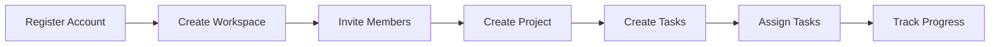

# SprintHub – Product Requirements Document (PRD)

> Product requirements for the SprintHub MVP, defining business objectives, target users, product scope, and release planning.

---

| Property         | Value                               |
| ---------------- | ----------------------------------- |
| **Document**     | Product Requirements Document (PRD) |
| **Project**      | SprintHub                           |
| **Version**      | 1.0                                 |
| **Status**       | Approved                            |
| **Owner**        | Nicolás Palacio                     |
| **Last Updated** | July 2026                           |

---

# Table of Contents

1. Product Overview
2. Problem Statement
3. Product Goals
4. Target Users
5. User Personas
6. MVP Scope
7. Future Scope (Post-MVP)
8. User Journey
9. Core User Flows
10. Success Metrics
11. Release Plan
12. Risks
13. Definition of Done

---

# 1. Product Overview

## Product Name

SprintHub

## Product Type

Software as a Service (SaaS)

## Category

Project Management & Team Collaboration Platform

## Vision

SprintHub is a collaborative project management platform that helps teams organize work, manage projects, track tasks, and monitor team productivity through a modern and scalable workspace-based system.

The goal is to provide a clean and intuitive experience inspired by tools such as Jira, ClickUp, Trello, and Asana while demonstrating modern software engineering practices.

---

# 2. Problem Statement

Small teams and individuals often struggle to manage projects effectively due to:

- Scattered information across multiple tools.
- Lack of visibility into project progress.
- Poor task ownership tracking.
- Limited collaboration capabilities.
- Complex and expensive enterprise tools.

SprintHub addresses these challenges by providing a centralized platform where teams can organize their work, collaborate efficiently, and manage projects through a simple, scalable, and modern workspace-based experience.

---

# 3. Product Goals

## Business Goals

SprintHub aims to:

- Improve project organization.
- Increase team visibility.
- Simplify task management.
- Enable team collaboration.

---

## Technical Goals

SprintHub is also designed to demonstrate production-ready software engineering practices, including:

- Scalable software architecture.
- Authentication and authorization.
- Testing strategies.
- Continuous Integration and Continuous Deployment (CI/CD).
- DevOps best practices.

The project serves both as a functional project management platform and as a portfolio-quality software engineering project that showcases modern development practices.

---

# 4. Target Users

SprintHub is designed for individuals and small teams that need a lightweight, intuitive, and scalable project management solution.

## Primary Users

### Individual Users

Users managing personal projects, freelance work, or independent initiatives.

**Needs**

- Organize personal tasks.
- Track project progress.
- Improve productivity.
- Maintain visibility across multiple projects.

---

### Small Teams

Teams consisting of approximately 2 to 20 members collaborating on shared projects.

**Needs**

- Assign tasks.
- Collaborate efficiently.
- Track project progress.
- Maintain clear ownership and responsibilities.

---

### Startup Teams

Growing companies that require a flexible project management platform without the complexity of enterprise solutions.

**Needs**

- Manage multiple projects.
- Coordinate team members.
- Improve visibility across initiatives.
- Monitor overall project progress.

---

# 5. User Personas

SprintHub is designed around the needs of its primary user groups.

---

## Persona 1 – Software Developer

| Property | Value                |
| -------- | -------------------- |
| **Name** | Alex                 |
| **Role** | Full Stack Developer |

### Goals

- Organize development tasks.
- Track implementation progress.
- Collaborate with teammates.

### Pain Points

- Losing track of priorities.
- Managing multiple projects simultaneously.

---

## Persona 2 – Project Manager

| Property | Value           |
| -------- | --------------- |
| **Name** | Sarah           |
| **Role** | Project Manager |

### Goals

- Monitor project status.
- Assign responsibilities.
- Measure project progress.

### Pain Points

- Lack of project visibility.
- Delayed task completion.
- Difficulty tracking ownership.

---

## Persona 3 – Startup Founder

| Property | Value   |
| -------- | ------- |
| **Name** | David   |
| **Role** | Founder |

### Goals

- Manage multiple initiatives.
- Track team productivity.
- Maintain visibility across projects.

### Pain Points

- Disorganized workflows.
- Communication gaps.
- Limited project transparency.

---

# 6. MVP Scope

The Minimum Viable Product (MVP) includes the minimum set of features required to provide a complete project management workflow while maintaining a manageable implementation scope.

---

## Authentication

The MVP includes:

- User registration.
- User login.
- User logout.
- Refresh Token authentication flow.
- Role-Based Access Control (RBAC).

---

## Workspace Management

The MVP supports:

- Create workspace.
- Update workspace.
- Delete workspace.
- Invite members.

---

## Member Management

Workspace administrators can:

- Add members.
- Remove members.
- Manage member roles.

Supported roles include:

- OWNER
- ADMIN
- MEMBER

---

## Project Management

Users can:

- Create projects.
- Update project information.
- Archive projects.
- Delete projects.

---

## Task Management

Users can:

- Create tasks.
- Update tasks.
- Delete tasks.
- Assign tasks.
- Update task status.
- Set task priority.
- Define due dates.

---

## Dashboard

The MVP dashboard provides:

- Active projects.
- Pending tasks.
- Completed tasks.
- Overdue tasks.

---

## Notifications

The MVP includes in-application notifications for:

- Task assignments.
- Workspace invitations.
- Task status changes.

Future notification channels such as email, push notifications, and real-time notifications are intentionally excluded from the MVP and are planned for future releases.

---

# 7. Future Scope (Post-MVP)

The following features are intentionally excluded from the MVP and are planned for future releases.

---

## Collaboration

Future collaboration features include:

- Task comments.
- File attachments.
- Activity timeline.
- User mentions.
- Team chat.

---

## Productivity

Future productivity enhancements include:

- Labels.
- Custom fields.
- Time tracking.
- Sprint planning.
- Advanced Kanban board.
- Task dependencies.

---

## Notifications

Future notification capabilities include:

- Email notifications.
- Push notifications.
- Real-time notifications.

---

## Integrations

Future integrations may include:

- Google Calendar.
- GitHub.
- Slack.
- Microsoft Teams.

---

## Infrastructure

Future infrastructure improvements may include:

- Distributed caching.
- Background job processing.
- Queue-based notifications.
- WebSocket support.
- Horizontal scaling.

> **Note**
>
> These infrastructure enhancements are not part of the MVP. The application architecture has been designed to support their integration in future versions without requiring significant architectural changes.

---

# 8. User Journey

The following journey illustrates the primary experience of a new user interacting with SprintHub.



## Journey Summary

A typical user will:

1. Register an account.
2. Create a workspace.
3. Invite team members.
4. Create a project.
5. Add tasks.
6. Assign responsibilities.
7. Monitor project progress through the dashboard.

---

# 9. Core User Flows

The MVP focuses on a small set of core workflows that represent the primary value of SprintHub.

---

## Authentication Flow

```text
Register
    ↓
Login
    ↓
Access Dashboard
    ↓
Use Application
    ↓
Logout
```

---

## Workspace Flow

```text
Create Workspace
    ↓
Invite Members
    ↓
Assign Roles
    ↓
Manage Workspace
```

---

## Project Flow

```text
Create Project
    ↓
Create Tasks
    ↓
Assign Tasks
    ↓
Track Progress
    ↓
Archive Project
```

---

## Task Flow

```text
Create Task
    ↓
Assign User
    ↓
Update Status
    ↓
Complete Task
```

---

# 10. Success Metrics

The success of the MVP will be evaluated using qualitative and functional metrics rather than business KPIs.

## Functional Success

The MVP is considered successful if users can:

- Register and authenticate successfully.
- Create and manage workspaces.
- Collaborate with team members.
- Create and manage projects.
- Create, assign, and complete tasks.
- Track project progress through the dashboard.

---

## Technical Success

The project should demonstrate:

- Clean and maintainable architecture.
- Consistent API design.
- Secure authentication.
- Reliable database design.
- Automated testing.
- CI/CD automation.
- Comprehensive technical documentation.

---

## Product Success

SprintHub successfully fulfills its purpose when it provides a simple, intuitive, and scalable project management experience while showcasing modern software engineering best practices.

---

# 11. Release Plan

SprintHub will be delivered incrementally, prioritizing the core functionality required for the MVP before introducing advanced capabilities.

---

## Phase 1 – Foundation

The first phase focuses on establishing the technical foundation of the application.

Deliverables include:

- Project setup.
- Frontend architecture.
- Backend architecture.
- Database configuration.
- Authentication infrastructure.
- CI/CD pipeline.
- Technical documentation.

---

## Phase 2 – MVP

The MVP introduces the core functionality required for project management.

Deliverables include:

- User authentication.
- Workspace management.
- Member management.
- Project management.
- Task management.
- Dashboard.
- In-application notifications.

---

## Phase 3 – Future Enhancements

Future releases may introduce additional capabilities, including:

- Task comments.
- File attachments.
- Email notifications.
- Push notifications.
- Real-time collaboration.
- Calendar integrations.
- Advanced reporting.
- Performance optimizations.
- Infrastructure enhancements such as distributed caching and background job processing.

These features are intentionally excluded from the MVP and will be prioritized based on future product requirements.

---

# 12. Risks

The following risks have been identified during product planning.

| Risk                     | Impact | Mitigation                                                                                      |
| ------------------------ | ------ | ----------------------------------------------------------------------------------------------- |
| Scope expansion          | High   | Maintain a strict MVP scope and prioritize essential functionality.                             |
| Technical complexity     | Medium | Adopt a modular architecture and incremental implementation strategy.                           |
| Security vulnerabilities | High   | Follow secure authentication practices, validate all inputs, and apply security best practices. |
| Schedule delays          | Medium | Deliver the project incrementally and prioritize high-value features first.                     |
| Maintainability issues   | Medium | Follow coding standards, documentation guidelines, and architectural principles.                |

---

# 13. Definition of Done

A feature is considered complete when it satisfies all functional, technical, and quality requirements.

## Functional Requirements

- Acceptance criteria have been met.
- Business requirements have been implemented.
- Edge cases have been considered.
- User experience has been validated.

---

## Technical Requirements

- Code follows project standards.
- TypeScript compilation succeeds without errors.
- Linting passes successfully.
- Unit tests pass.
- Integration tests pass where applicable.
- API documentation has been updated when required.
- Database migrations have been created when necessary.

---

## Documentation Requirements

Relevant documentation has been updated when applicable, including:

- Product Requirements Document (PRD)
- Software Requirements Specification (SRS)
- Architecture Design Document (ADD)
- Database Design Specification (DDS)
- API Design Specification (ADS)
- Developer Guide
- README

---

## Review Requirements

Before a feature is merged:

- Code has been reviewed.
- All CI checks pass successfully.
- No critical defects remain.
- Documentation is complete.
- The feature is ready for deployment.

---

# Conclusion

The Product Requirements Document defines the functional vision and business scope for the SprintHub MVP.

It establishes the product goals, identifies the target users, defines the core functionality, and outlines the roadmap for future evolution. Together with the supporting technical documentation, this document serves as the foundation for implementation and ensures that product decisions remain aligned with the project's long-term vision.

---
